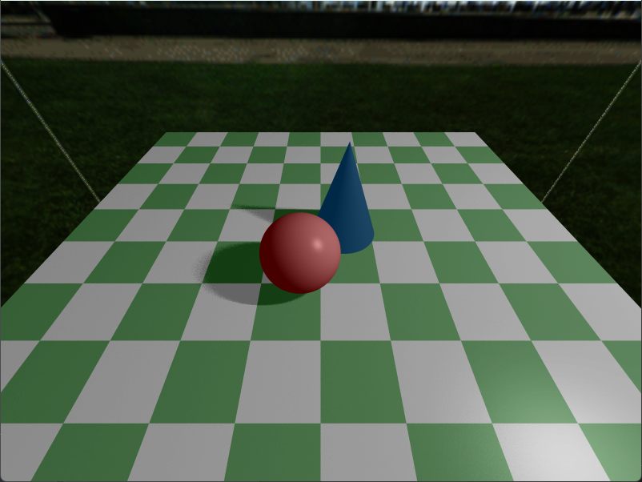
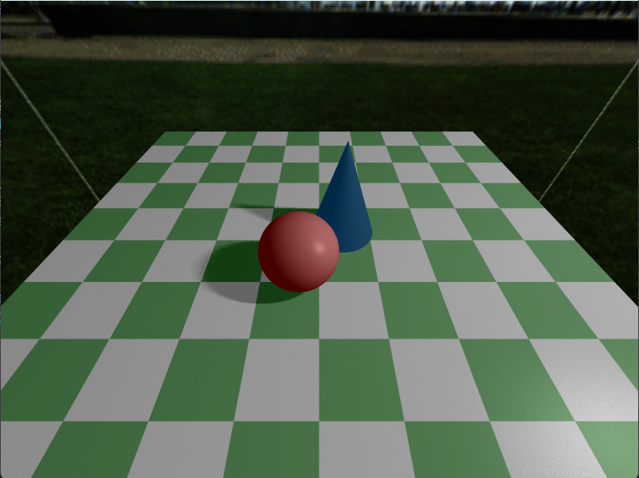
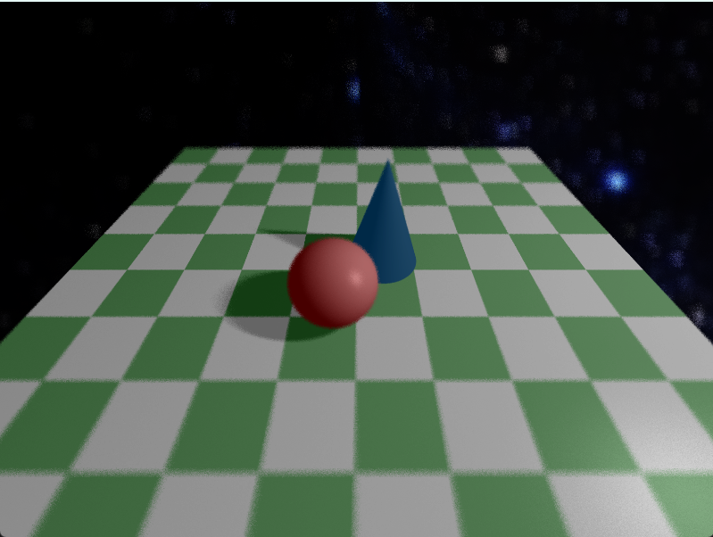

# CS248-Assignment4: Advanced Ray Tracing

Tianqi Xu

## How to run

1. Install rust develop kit including `cargo`.
2. Use `cargo run` to run the program.

## Features

- [x] spherical environment mapping
- [x] cube environment mapping
- [ ] refraction and attenuation
- [x] antialiasing
- [x] soft shadows
- [x] depth of field
- [x] glossy reflection
- [ ] motion blur

## Screenshot

All of following scenes are running with 5x5 stratified supersampling.

#### Cube mapping + antialiasing + soft shadows

#### Cube mapping + antialiasing + soft shadows + glossy reflection

#### Cube mapping + antialiasing + soft shadows + glossy reflection + depth of field

#### Spherical mapping + antialiasing + soft shadows + glossy reflection + depth of field

